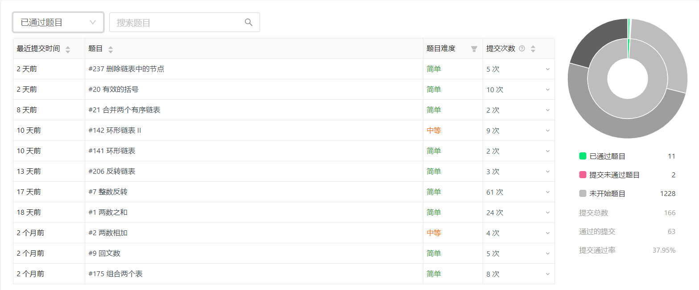

# *Br*ushing makes me happy. *S*elf-discipline makes me free

---

> **目录结构**

+ main.java.studey.advance
    + BaseArithmetic （基础算法Demo）
    + DataStructure  （数据结构） 
    + QuestionTypes  （LeetCode 题目解法）
+ test.java.advance
    + BaseArithmetic （基础算法Demo TestCase）
    + QuestionTypes  （LeetCode 题目解法 TestCase）
    
> **刷题记录**

+ 2019.8.26 刷题总量 (1) {数据库相关 <a href='https://leetcode-cn.com/problems/combine-two-tables/'>[175. 组合两个表]</a>} .

+ 2019.9.2 刷题总量 (4) {算法相关 <a href='https://leetcode-cn.com/problems/two-sum/'>[1. 两数之和]</a>  <a href='https://leetcode-cn.com/problems/add-two-numbers/'>[2. 两数相加]</a>  <a href='https://leetcode-cn.com/problems/palindrome-number/'>[9. 回文数]</a>} .

+ 2019.10.25 刷题总量 (10)

+ 2019.11.1 刷题总量 (16)