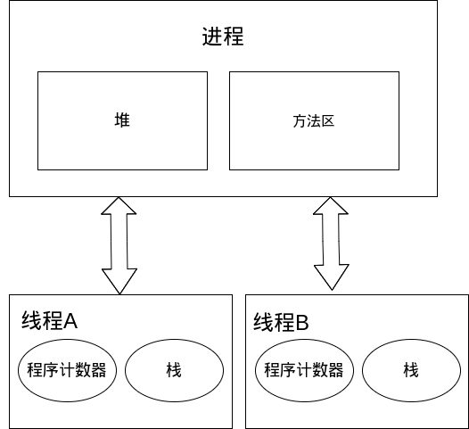
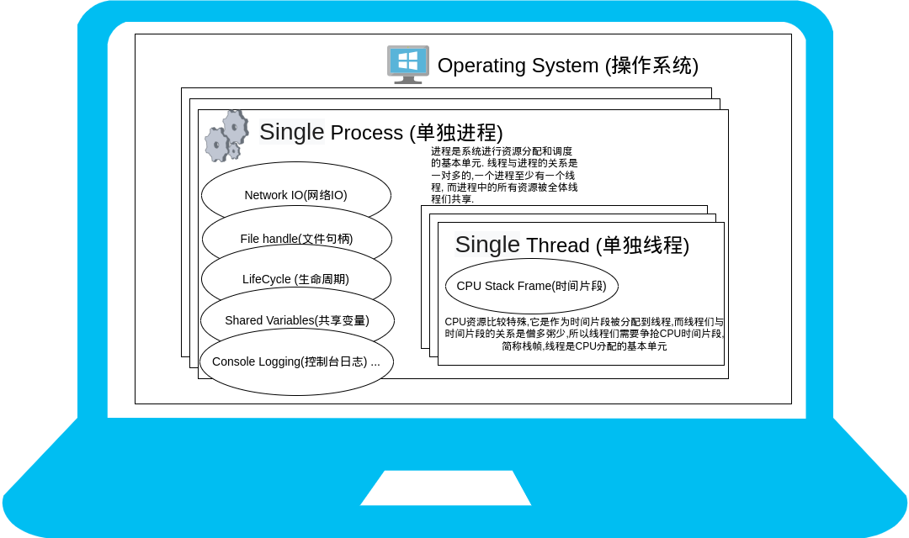

## 简介

> 本文是书中Java并发编程基础篇第一章第一小章节, 本小章节不包含代码, 全文为图文总结.
> 本章介绍了, 什么是线程以及进程, 线程与进程在资源上的区别.

## 线程/进程图文

如1-1图所示, 从JVM角度看待线程与进程, **线程与进程的关系是一对多的,一个进程至少有一个线程, 而进程中的资源被所有线程共享**. 

进一步说,进程是代码在数据集合上的一次运行活动, **进程是系统进行资源分配和调度的基本单元**,线程则是一个执行路径.

如1-2图所示,从操作系统角度看待线程与进程资源, CPU资源是比较特殊,它是作为时间片段被分配到线程,而线程们与时间片段的关系是僧多粥少,所以线程们需要争抢CPU时间片段,简称栈帧,**线程是CPU分配的基本单元**.

回到Java上来, 每当我们运行包含main方法的Java文件时, 其实是启动了一个JVM进程, 而**main方法所在的线程被成为主线程**,

在1-2图中, 用JVM的视角去看待进程, 进程只有堆和方法区的资源, 而线程则包含程序计数器与栈, 那么它们都有什么作用呢?

## 线程与进程的共同点与区别

如图1-1,1-2所示, 区别在JVM视角与操作系统视角是不一样的, 共同点是都是一种抽象的资源隔离概念,在Java中都是需都是要借助JVM进行托管, JVM负责管理进程资源分配与线程调度.  

## Q&A

>  程序计数器记录native与java方法的区别?

**Answer: 执行 native 方法记录为undefined, 只有执行Java代码时pc计数器才是下一条命令的地址.**

> 进程与线程的主要区别是什么?

**Answer: 1.线程是CPU调度分配的最小单元, 进程是系统资源分配的最小单元, 2.进程之间不能共享数据, 线程之间可以共享数据**

> Java 中存在内存屏障吗?

**Answer: Java 中存在内存屏障。 内存屏障是一种指令，用于控制不同处理器的内存访问顺序。它们对于确保线程之间的数据可见性至关重要。**
**Java 中有两种类型的内存屏障：**

+ **发生前（Happens-Before）内存屏障： 确保一个操作在另一个操作之前发生。例如，LoadStore 屏障确保在存储操作之后读取操作之前刷新内存。**
+ **释放（Release）内存屏障： 确保一个操作将数据存储到内存中，使其对其他处理器可见。例如，StoreLoad 屏障确保在存储操作之后加载操作之前将数据刷新到内存。**

> JVM 何时会自动插入内存屏障？

VM 会在以下情况下自动插入内存屏障
+ volatile 变量的读写操作
+ 对象锁的获取和释放
+ 垃圾收集

> Question: 并行与并发的区别是什么?

**Answer:**

| 特性 | 并行 | 并发 |
| :----:| :----: | :----: |
| 执行方式 | 同时执行 | 交替执行 |
|硬件要求	|多个处理器或核	|单个处理器或核|
|效率	|更高	|较低|
|应用场景	|高性能计算、图形处理等| 多任务处理、用户界面等|